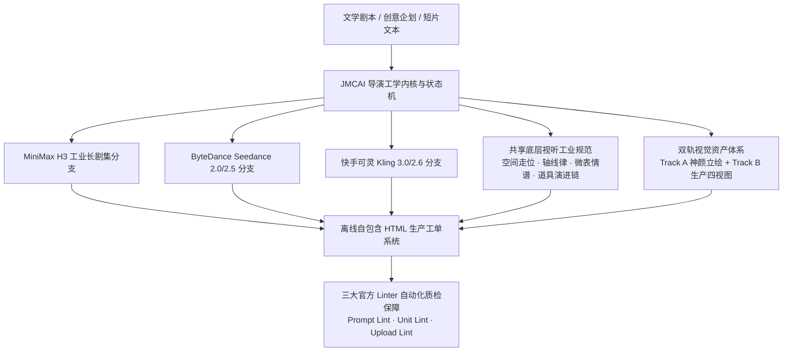

# JMCAI Shotlist Builder (电影级工业分镜与视觉工单构建系统)

[](file:///c:/Users/cdall/Downloads/土豆/SKILL2.0基础款/jmcai-shotlist-builder)
[](file:///c:/Users/cdall/Downloads/土豆/SKILL2.0基础款/jmcai-shotlist-builder)
[](file:///c:/Users/cdall/Downloads/土豆/SKILL2.0基础款/jmcai-shotlist-builder)
[](file:///c:/Users/cdall/Downloads/土豆/SKILL2.0基础款/jmcai-shotlist-builder)

> **JMCAI Shotlist Builder** 是面向 AI 电影、商业短剧与高品质生成式视听内容创作的**工业级视听分镜拆解、全模态资产台账规划与离线自包含 HTML 生产工单构建系统**。
> 本系统深度打通 **MiniMax H3（海螺视频）**、**ByteDance Seedance 2.0 / 2.5** 与 **快手可灵 Kling 3.0 / 2.6** 三大主流视频大模型，建立了一套严格的电影学视听工程标准，彻底解决 AI 视频制作中“口型漂移、多镜头人物穿帮、道具自动复原、大模型语法割裂、运镜无动机、操作员上传错位”等工业化落地痛点。

---

## 一、 系统全景架构与多引擎矩阵



### 1. 三大视频引擎深度适配特性对比

| 核心维度 | MiniMax H3 (海螺视频) | ByteDance Seedance 2.0 / 2.5 | 快手可灵 Kling 3.0 / 2.6 |
| :--- | :--- | :--- | :--- |
| **黄金单段时长** | **10–15 秒**（严格上限 15.0s） | **原生 30 秒**（长运镜时空连续性） | **5–10 秒**（高动作密度与写实物理） |
| **核心提示词形态** | **三模态工整对仗**（分镜版/中文执行版/英文执行版） | **多层运镜情绪语法**（带标定符号） | **五层结构化契约**（主体/镜头/对白/负向） |
| **专有语法标记** | `<Subject N>`, `<Picture N>`, `<Audio N>`, `<d>...</d>` | `( )` 权重、`< >` 运镜、`{ }` 动作、`【 】` 状态 | `[Character A: ...]`, `Shot N (0-Ns)` |
| **声画同步契约** | `<Audio N>` 槽位绑定 + 纯中文台词口型逐字闭环 | 画面节奏与背景音乐微节拍联动 | P1–P4 多角色发言轮转对白协议 |
| **参考资产上限** | **9 张图片 + 3 部视频 + 3 轨音频** | 50-Slot 资产与动作锚定槽位 | 角色面容库 + 关键帧垫图 |
| **防穿帮机制** | 强制执行“四大保留策略”（reference / weak / copy） | 防泥化守护块（Anti-mush guard blocks） | 防融化负向约束集（Anti-melting constraints） |
| **适用核心场景** | **长剧集多镜头叙事、强对话、口型声线强绑定** | **大动态动作戏、长镜头跟拍、复杂空间走位** | **微表情特写、写实光影质感、短片段爆发戏** |

---

## 二、 MiniMax H3 四大智能路由与生成模式 (Routing Engine)

本系统内置智能路由选择器（`reference/MINIMAX_H3_ROUTING.md`），针对不同的剪辑与机位衔接诉求，自动锁定开篇法定申明与提示词架构：

1. **`I2VA` (首帧精确锚定生成 · Image-to-Video Anchor)**
   * **开篇申明**：`[首帧锚定生成] 严格沿用已确认的首帧画面起幅...`
   * **适用场景**：从指定第一帧画面（如定妆图、上一单元尾帧或概念原画）向前自然推进动态。
2. **`FL2VA` (首尾帧双向过渡生成 · First-and-Last-Frame Transition)**
   * **开篇申明**：`[首尾帧过渡生成] 画面严格从首帧起始，并在结尾收敛过渡至指定的尾帧终幅...`
   * **适用场景**：极度适合两极分镜头插值过渡（如：从主角近景推移到远景背影，或从静坐平滑过渡到站立凝视）。
3. **`L2VA` (尾帧定向对齐生成 · Last-Frame Alignment)**
   * **开篇申明**：`[尾帧对齐生成] 镜头动作终点收敛至指定的目标构图与人物姿态...`
   * **适用场景**：必须精准平滑对齐下一场次固定起幅或特定历史剧照。
4. **`Ref2VA` (多参考图外观与环境继承生成 · Reference-based Video)**
   * **开篇申明**：`[参考生成] 画面多主体外观继承自以下定义参考图...`
   * **适用场景**：由多张角色立绘、四视图、场景空镜和道具参考拼合的大型叙事镜头，最广泛的叙事生产主力模式。

---

## 三、 声音与口型三段式时序工程 (Dialogue Timing Craft)

针对 AI 生成视频最易翻车的“吞字、抢画、语速爆音、画外音瞎张嘴”，系统制定了严格的时序规约：

### 1. 台词三段式微时间轴
每个发音镜头严禁将台词直接塞入整个镜头时长，必须切分为三段物理窗口：
* **前置准备拍（Pre-line thought/breath window，0.3~0.8s）**：
  * 必须预留说话前的吸气、眼神微移、喉结微动或张口预备微反应；
* **对白进行时（Spoken dialogue window）**：
  * 严格遵守安全字数预算硬约束：
    * **10 秒片段**：安全预算 $\le 24$ 字；
    * **12 秒片段**：安全预算 $\le 30$ 字；
    * **15 秒片段**：安全预算 $\le 36$ 字（极端硬顶上限 40 字）；
* **后置余韵拍（Post-line consequence/silence window，0.8~1.5s）**：
  * 必须预留话音刚落后的停顿、吞咽、视线下移或听者反应，**严禁最后一字说完立即切镜**！

### 2. 画外音闭嘴绝对保护律 (Off-screen Voiceover Rule)
当台词为内心独白（OS）或画外音时，在提示词中必须紧跟法定防护声明：
> `（(S1) 此时紧闭嘴唇，面部无任何下颌开合与咀嚼动作，呼吸平静，声音纯为画外音内心独白）。`

---

## 四、 音频槽位双模态契约 (Audio Reference vs Reuse)

通过 `<Audio N>` 槽位调度外部音频资产时，强制区分两大使用语义：
* **`audio reference`（音色语速参考）**：
  * 仅借鉴发音人的声线音色、共鸣频率、年龄感与语速节奏；
  * **必须显式排除原音频的具体台词内容与声波波形**，严防原素材窜音；
* **`audio reuse`（实拍原音复用）**：
  * 精准复用原音频中的特定拟音、笑声、叹息声或实拍环境音，并要求画面口型精准对齐原声。

---

## 五、 共享底层视听工业工学体系 (Shared Directing Core)

跨越所有大模型，底层全部基于好莱坞正统电影学与视听工业标准构建：

### 1. 剧本原子节拍拆解 (Source Beats to Shot Beats)
* 剧本中每个实质动作与台词映射为独立的 `SOURCE_BEAT`，再绑定到镜头拍（`SHOT_BEATS`），绝不随意删减剧情冲突。

### 2. 空间走位调度与 180 度轴线系统 (Spatial Blocking)
* **多人对话场景**：自动输出顶视空间走位调度图（Top-down SVG），标明角色坐标、距离（米）、面部视线交角与摄影机机位轴线；
* **严防越轴**：在整个单元切镜中严格锁死 180 度关系线，确保观众左右空间认知不发生颠倒。

### 3. 电影胶片仿真矩阵与 45 度道具规范
* **胶片感工程 (Film Stock Matrix)**：
  * `Kodak Vision3 500T 5219`：微光夜景高感、青蓝阴影、暖黄高光；
  * `Kodak Portra 400`：柔和暖调肤质、通透毛孔、温润高光溢出；
  * `Fuji Eterna 250D`：清冷日光、低饱和宽容度、日系电影感；
* **45 度信物道具展示规范**：
  * 独立道具资产采用纯白背景、微距 45 度斜俯视静物摄影排版，标清材质纹理、刻字与岁月磨损细节。

### 4. 演员微表情泄漏律与微表演谱 (Micro-Performance Score)
* 拒绝 AI 假性眨眼与面瘫假笑，严格遵循：
  `外在假面 (Mask)` $\rightarrow$ `隐藏情绪 (Hidden)` $\rightarrow$ `刺激触发 (Trigger)` $\rightarrow$ `微弱泄漏 (First Leak)` $\rightarrow$ `理性压制 (Suppression)` $\rightarrow$ `情绪极性锁定 (Polarity Lock)`。

### 5. 关键道具物理演进时间链 (Prop State Progression Chain)
* 追踪核心道具（机车、风衣、信物、手枪）的崭新、磨损、划痕、血渍状态演进，杜绝跨镜头“自动复原”穿帮。

---

## 六、 双轨视觉资产体系与三大生图管线矩阵

```text
               ┌── Track A: 神颜定妆立绘 (即梦5.0/MJ三大铁律: 东亚骨相/哑光无油/对称双眼)
核心角色资产 ──┤
               └── Track B: 生产四视图 (16:9 横向非对称排布: 1/4面部特写 + 3/4三面全身)
```

为了兼顾不同团队的计算硬件环境与协作场景，系统原生打通并支持**三大生图接入管线**：

### 1. 管线 A：智能体客户端原生直接生图 (Agent Native Direct Generation)
* **零门槛免配置**：创作者电脑**无需独立显卡、无需配置 Python 环境或部署 ComfyUI**；
* **原生多模态工具驱动**：Antigravity 智能体直接调用客户端内置的 **`generate_image`** 原生大模型生图工具，秒级渲染高质量概念立绘、场景与道具；
* **多图引导与视觉控制**：支持通过 `ImagePaths` 挂载已有角色参考图或关键帧，实现姿态引导、特征保留与面容连续性；
* **全自动入库与工单装配**：生成的图像由智能体全自动重命名、校验分辨率、转换为规范格式并保存至 `assets/` 目录，无需人工搬运，即时点亮 HTML 工单的双轨画廊与内联缩略图。

### 2. 管线 B：本地 / 远端 ComfyUI 工作流管线 (ComfyUI via comfypet-jmcai-skill)
* **专业级精准控制**：适合拥有本地高性能 GPU（如 RTX 4090）或局域网私有生图服务器的专业视效工作室；
* **双阶段工作流矩阵**：
  * **定妆神颜立绘**：调度 `z-image`（Z-image-高清生图流）完成 2 倍超分放大与皮肤质感重绘；
  * **三维生产四视图**：调度 `krea2-2`（▶四视图生成流-krea2），以定妆立绘为引导高速生成包含正、侧、背、3/4 视角的标准四视图；
  * **画质细节修复**：调度 `flux2-klein-lcs` 实现去油画质增强与局部细节微修。

### 3. 管线 C：第三方商业 Web 大模型直投 (Midjourney / 即梦 5.0 / 奇域)
* **工业级合规提示词输出**：系统严格遵循“三大工程铁律”，自动导出无需修改即可直接一键复制的中文/英文专业立绘词与横向 16:9 非对称四视图词；
* **双轨一键复制微交互**：工单内各资产卡片均配备独立复制按钮，创作者在网页端生成满意图片后，只需放入 `assets/` 目录即可自动完成双轨联动。

---

## 七、 14 项终素质检单与 5 套致命翻车急救卡

### 1. 14 项防穿帮核对单 (14-Point Continuity Checklist)
1. 角色骨相面容跨镜头锁定
2. 服装款式、层叠与领口锁定
3. 核心道具物理状态演进匹配
4. 180 度轴线与左右视线关系线
5. 视线交角方向严格匹配 (Eyeline Match)
6. 光源入射方向与色温连续性
7. 环境底噪与天气声场一致性
8. 动作切点动势接戏 (Cutting on Action)
9. 口型与对白时间轴硬约束
10. 台词字数预算安全合规 (≤36字)
11. 画外音内心独白闭唇防张口
12. 镜头结尾预留 0.8–1.0s 稳定把手 (Handle)
13. 首尾帧过渡平滑性 (FL2VA 插值)
14. 提示词无相对代词（禁止“同上/承接上一段”）

### 2. 5 大典型翻车场景急救卡 (Fixes Cheat Sheet)
* 🚑 **急救卡 1（脸部忽大忽小/长相漂移）**：注入纯正面面容锚定词，收紧镜头景别（MCU），移除过多背景装饰词汇；
* 🚑 **急救卡 2（动作黏连/融化变形）**：将复合动作拆解为单个简单动词，加入反泥化守护块，缩短单镜头物理运动时间；
* 🚑 **急救卡 3（背景乱码文字/水印乱入）**：在负向词中强化 `text, watermark, typography, subtitles`，场景提示词加入“空镜无人，干净建筑立面”；
* 🚑 **急救卡 4（口型不同步/吞字爆音）**：将台词字数裁切 20%，在说话前增加 0.5s 吸气微反应描述，检查 `<d>[Chinese]...</d>` 容器完整性；
* 🚑 **急救卡 5（跳切突兀/空间穿帮）**：在出幅镜头增加动作触发点（转头、伸手），入幅镜头承接动作结果（拿起、对视），保持动势矢量连续。

---

## 八、 离线自包含 HTML 生产工单六大组件

工单具备 **100% 离线自包含、零外部 CDN 依赖、毫秒级原生交互**：
1. **双轨资产画廊**：主角卡片原生搭载 `[ 立绘定妆 | 角色四视图 ]` 切换条，秒级比对；
2. **关键道具演进时间链**：时间线清晰展示道具物理破损节点；
3. **视听彩色胶囊徽章条**：5 枚微晶高光徽章（焦段/景别/运镜/光影/微表情）；
4. **三模态工整对仗选项卡**：导演分镜版 / 中文执行版 / 英文执行版无刷新平滑切换，带一键复制高光反馈；
5. **上传清单内联微缩图与悬停预览**：44px 列表缩略图 + 260px 高清浮动大图，带暗黑自愈占位；
6. **14 项防穿帮终素质检单与急救卡**：全套急救方案直接内嵌于工单底部，随时查阅。

---

## 九、 严格五阶段状态机 (State Machine & Gates)

| 阶段代码 | 状态名称 | 核心职责 | 绑定的“用户确认”闸口 (Gate) |
| :--- | :--- | :--- | :--- |
| **Phase 0** | `LOCK_PLATFORM` | 确定目标大模型平台 | **强停顿**：询问选择 `Seedance 2.0/2.5`、`MiniMax H3` 还是 `Kling 3.0`，停顿等用户确认。 |
| **Phase 1** | `SCRIPT_GROUNDING` | 剧本全文解析与时空锚定 | 提取场次、角色、道具演进、情感弧光与总时长（内部推演，不停顿）。 |
| **Phase 2** | `REQUEST_ASSETS` | 资产清单与声线意图解析 | **强停顿**：列出人设/四视图/道具清单，确认 `AUDIO_REFERENCE_INTENT`，**停顿等用户提供/确认**。 |
| **Phase 3** | `LOCK_BLUEPRINT` | 空间调度与蓝图校准 | **强停顿**：<br>1. 多人同框提供俯视走位图 (SVG) 等批准；<br>2. 多单元项目**仅先输出第 1 单元作为校准预览**，停顿等批准后再全量扩展。 |
| **Phase 4** | `DIRECT_AND_COMPILE`| 分镜编制与 HTML 编译 | 组装双轨画廊、徽章、内联微缩图、三模态 Tab，执行三大 Linter 校验闭环交付。 |

---

## 十、 自动化质量门禁与测试套件 (Linters & CLI)

在工程根目录下，所有 Python 脚本统一通过 `uv` 依赖管理器驱动：

### 1. 运行核心回归测试套件
```bash
# 契约与口型绑定回归测试
uv run python scripts/h3_regression_tests.py

# 上传清单与角色映射测试
uv run python scripts/h3_upload_order_tests.py
```

### 2. 对生成的 HTML 生产工单执行三大官方质检
```bash
# 1. 提示词结构与双模态台词逐字一致性质检
uv run python scripts/h3_prompt_lint.py <工单文件名>.html

# 2. 单元时长 (15.0s) 与台词字数预算 (≤36字) 质检
uv run python scripts/h3_unit_lint.py <工单文件名>.html

# 3. 操作员上传清单完整性、微缩图与资产链接质检
uv run python scripts/h3_upload_order_lint.py <工单文件名>.html
```

---

## 十一、 31 篇参考规约深度导航与架构索引

系统将专业视听工业规范梳理为 `reference/` 目录下的 31 篇深度规约：

| 领域分类 | 规约文件名 | 核心内容简介 |
| :--- | :--- | :--- |
| **电影导演工学** | `CAMERA_EMOTION.md` | 摄影机运镜情绪学派（推拉摇移升降心理学映射） |
| | `CAMERA_LIGHTING_VOCABULARY.md` | 好莱坞专业运镜、景别与布光词典 |
| | `DRAMATURGY_MONTAGE_LAW.md` | 蒙太奇视听剪辑律与镜头接切因果链 |
| | `SPATIAL_BLOCKING.md` | 空间走位调度、180度轴线与俯视 SVG 设计 |
| | `HELL_GRIND_ADAPTATION.md` | 极限磨镜与表演校准体系（目标-阻碍-策略-行为残余） |
| **ByteDance Seedance** | `SEEDANCE_25_PRODUCTION_SPEC.md` | Seedance 2.5 四种括号官方语法、30s运镜与50-Slot规范 |
| | `PROMPT_DENSITY.md` | 提示词密度与词频权重分配规范 |
| | `PROMPT_PATTERNS.md` | 经典镜头运镜模式与时空推演范式 |
| | `STYLE_BLOCK.md` | 画风影调风格块定义与锁定 |
| | `MICRO_BEATS.md` | 毫秒级微节拍调度法 |
| **快手可灵 Kling** | `KLING_PROMPT_CONTRACT.md` | 可灵 3.0 五层结构契约、主体锚定与 P1-P4 对白协议 |
| **MiniMax H3 长剧集** | `MINIMAX_H3_LONG_SCRIPT_UNITS.md` | 10–15 秒黄金叙事单元切分与长剧集全流程蓝图 |
| | `MINIMAX_H3_CHINESE_MACHINE_PROMPT_SPEC.md`| 中文执行六段式规范（主体/摘要/保留/详述/音响/音乐） |
| | `MINIMAX_H3_DUAL_PROMPT_CONTRACT.md` | 中英文双模态提示词逐字台词绝对对齐契约 |
| | `MINIMAX_H3_AUDIO_REFERENCE_BINDING.md` | 音频参考槽位绑定规则与声线复用机制 |
| | `MINIMAX_H3_ACTOR_DIALOGUE_CRAFT.md` | 演员对白与口型时序工艺（防吞字与抢画） |
| | `MINIMAX_H3_MICRO_EXPRESSION.md` | 演员微表情泄漏律与微表演谱（假面与极性锁定） |
| | `MINIMAX_H3_TIMING_ENGINEERING.md` | 毫秒级切点与时序工程（Shot 1/Shot N 时间戳语法） |
| | `MINIMAX_H3_ROUTING.md` | I2VA / FL2VA / L2VA / Ref2VA 四大生成模式智能路由 |
| | `MINIMAX_H3_PLATFORM_LIMITS.md` | 官方 9 图 + 3 视频 + 3 音频上限与降级策略 |
| | `MINIMAX_H3_CROSS_CLIP_EDIT_CONTINUITY.md`| 跨片段剪辑连续性与首尾帧接戏规范 |
| **资产与防穿帮工程** | `PROMPT_TEMPLATE_ASSET_EXPANSION.md` | 神颜立绘三大工程铁律与横向 16:9 生产四视图模板 |
| | `VIDEO_CONTINUITY_FIXES_CHECKLIST.md` | 14 项跨镜头连续性防穿帮终素质检与 5 套急救卡 |

---

## 十二、 安装部署与快速上手

本技能完全遵循标准 Agent Skill 规范，**核心分镜规划与工单生成功能为纯规约驱动，零外部环境依赖**；同时自带开箱即用的纯 Python 标准库自动化质检工具链。

### 1. 技能安装部署方式

#### 方式 A：Git 克隆安装（推荐，便于同步官方更新）

直接将本仓库克隆至您使用的 Agent 客户端技能目录中：

* **Antigravity / Gemini CLI 环境**：
  * **全局安装**（所有项目随时可用）：
    * Windows (PowerShell):
      ```powershell
      git clone https://github.com/allen-Jmc/jmcai-shotlist-builder.git "$HOME\.gemini\config\skills\jmcai-shotlist-builder"
      ```
    * macOS / Linux:
      ```bash
      git clone https://github.com/allen-Jmc/jmcai-shotlist-builder.git ~/.gemini/config/skills/jmcai-shotlist-builder
      ```
  * **项目工作区局部安装**（当前项目内生效，便于团队协同）：
    ```bash
    git clone https://github.com/allen-Jmc/jmcai-shotlist-builder.git .agent/skills/jmcai-shotlist-builder
    ```

* **Claude Code / OpenClaw / Cursor 等 Agent 环境**：
  * 克隆至客户端对应的 skills 目录（如 `~/.claude/skills/jmcai-shotlist-builder`）即可自动加载。

---

#### 方式 B：Release ZIP 离线开箱即用

1. 从 [GitHub 仓库发布页](https://github.com/allen-Jmc/jmcai-shotlist-builder) 或交付渠道获取纯净分发包 `jmcai-shotlist-builder.zip`；
2. 直接解压至上述任一 Agent 的 skills 目录下（解压后的文件夹保持名称 `jmcai-shotlist-builder`）；
3. 刷新或重启智能体对话会话，Agent 即可自动识别并加载该技能。

---

### 2. 运行环境与依赖说明

| 功能层级 | 依赖需求 | 说明 |
| :--- | :--- | :--- |
| **剧本拆解 / 视听规划 / 三模态提示词 / HTML 工单输出** | **零依赖 (Zero-dependency)** | 纯 Prompt 与结构化规约驱动，任何主流大模型及 Agent 客户端直接读取 `SKILL.md` 即刻执行，**无需安装任何本地 Python 环境**。 |
| **本地自动化 Linter 质检与回归测试套件 (可选)** | **Python 3.10+** (原生标准库) | 内置的质量门禁脚本均采用 Python 标准库编写，推荐通过现代化依赖管理工具 `uv` 执行：<br>`uv run python scripts/h3_regression_tests.py` |

---

### 3. 开箱即用触发指令

向 AI 发送以下常见指令即可无缝激活本技能：
* 🎬 **短片/剧本全流程拆解**：*“我上传了一份短片剧本，请帮我拆解并制作完整的电影级分镜工单。”*
* 🌪️ **ByteDance Seedance 2.5 运镜生成**：*“请使用 Seedance 2.5 规约，生成带 30 秒长运镜标定符号的视频提示词。”*
* ⚡ **快手可灵 Kling 3.0 五层结构生成**：*“请为该剧本生成快手可灵 Kling 3.0 五层结构化提示词，包含角色对白协议。”*
* 💎 **MiniMax H3 工业 HTML 生产工单构建**：*“按照 MiniMax H3 规约，输出带双轨画廊、上传微缩图与三模态 Tab 的生产 HTML 工单。”*
